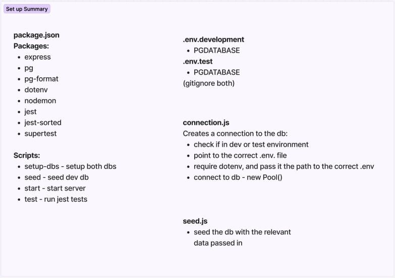

# JavaScript Backend Notes

Hi! This is hopefully everything you need to know about getting your backend up and running! 🚀

## Table of Contents

- [Setup](https://www.notion.so/JavaScript-Backend-Notes-146eea8c49ed803c8f84e76d6a640165?pvs=21) 🛠️
- [Dependencies (with links!)](https://www.notion.so/JavaScript-Backend-Notes-146eea8c49ed803c8f84e76d6a640165?pvs=21) 🔗
- [File Structure](https://www.notion.so/JavaScript-Backend-Notes-146eea8c49ed803c8f84e76d6a640165?pvs=21) 🗃️
- [.env.* files](https://www.notion.so/JavaScript-Backend-Notes-146eea8c49ed803c8f84e76d6a640165?pvs=21) 🗄️
- [package.json](https://www.notion.so/JavaScript-Backend-Notes-146eea8c49ed803c8f84e76d6a640165?pvs=21) 📦
- [app.js](https://www.notion.so/JavaScript-Backend-Notes-146eea8c49ed803c8f84e76d6a640165?pvs=21) 🌐
- [db folder](https://www.notion.so/JavaScript-Backend-Notes-146eea8c49ed803c8f84e76d6a640165?pvs=21) 🗄️
- [**tests** Folder](https://www.notion.so/JavaScript-Backend-Notes-146eea8c49ed803c8f84e76d6a640165?pvs=21) ❌✅
- [controllers folder](https://www.notion.so/JavaScript-Backend-Notes-146eea8c49ed803c8f84e76d6a640165?pvs=21) 🛂
- [models folder](https://www.notion.so/JavaScript-Backend-Notes-146eea8c49ed803c8f84e76d6a640165?pvs=21) 🔬
- [Scratch file and scripts](https://www.notion.so/JavaScript-Backend-Notes-146eea8c49ed803c8f84e76d6a640165?pvs=21) 😺
- [Other useful things](https://www.notion.so/JavaScript-Backend-Notes-146eea8c49ed803c8f84e76d6a640165?pvs=21) 🗒️

# Setup 🛠️



```bash
# quickstart terminal commands

npm init -y
npm i dotenv -D
npm i jest -D
npm i jest-sorted -D
npm i supertest -D
npm i nodemon -D
npm i express
npm i pg
npm i pg-format

# there's still more to do with package.json and
# .env files so continue reading below...
```

# Dependencies (with links!) 🔗

| Developer Dependencies: | Normal Dependencies: |
| --- | --- |
| [dotenv](https://www.npmjs.com/package/dotenv) - environment variables | [Express](https://expressjs.com) - servers, middleware |
| [Jest](https://jestjs.io) - testing suits | [Node Postgres](https://node-postgres.com) - connection pools, SQL injection protection (parameterized queries) |
| [Jest Sorted](https://www.npmjs.com/package/jest-sorted) - testing your database sort queries | [pg-format](https://www.npmjs.com/package/pg-format) - SQL injection protection for identifiers and literals when used with Node Postgres |
| [Supertest](https://www.npmjs.com/package/supertest) - testing your servers |  |
| [nodemon](https://www.npmjs.com/package/nodemon) - auto-restart servers after changes made |  |

# File Structure 🗃️

## Project Folder (root) 📁

[**app.js**](https://www.notion.so/JavaScript-Backend-Notes-146eea8c49ed803c8f84e76d6a640165?pvs=21) - Your endpoints live here. 

**.gitignore** - Add in file names and folders you want to ignore. Usually just .env files and node_modules folder, but could include others you don’t want uploaded.

[**.env.development and .env.test](https://www.notion.so/JavaScript-Backend-Notes-146eea8c49ed803c8f84e76d6a640165?pvs=21)** - Your environment variable files. **Add to .gitignore to avoid letting the world know your sensitive data.**

[**package.json**](https://www.notion.so/JavaScript-Backend-Notes-146eea8c49ed803c8f84e76d6a640165?pvs=21) - All kinds of useful info in here, including scripts and [dependencies](https://www.notion.so/JavaScript-Backend-Notes-146eea8c49ed803c8f84e76d6a640165?pvs=21).

**package-lock.json and node_modules** - Standard as part of your npm init -y.

[**scratch.sql](https://www.notion.so/JavaScript-Backend-Notes-146eea8c49ed803c8f84e76d6a640165?pvs=21)** - A convenient way to check SQL queries. See [below](https://www.notion.so/JavaScript-Backend-Notes-146eea8c49ed803c8f84e76d6a640165?pvs=21).

**README.md** - Your markdown file for telling users or visitors what your project is all about. Also a useful place to add setup instructions for your project. Would be a good idea to update this regularly throughout your development.

### **Subfolders: [db](https://www.notion.so/JavaScript-Backend-Notes-146eea8c49ed803c8f84e76d6a640165?pvs=21), [controllers](https://www.notion.so/JavaScript-Backend-Notes-146eea8c49ed803c8f84e76d6a640165?pvs=21), [models](https://www.notion.so/JavaScript-Backend-Notes-146eea8c49ed803c8f84e76d6a640165?pvs=21) and [__tests__](https://www.notion.so/JavaScript-Backend-Notes-146eea8c49ed803c8f84e76d6a640165?pvs=21)**

# .env.* files - links to [db](https://www.notion.so/JavaScript-Backend-Notes-146eea8c49ed803c8f84e76d6a640165?pvs=21) 🗄️

One liners pointing to your databases.

```jsx
// .env.development

PGDATABASE=production_database_name

// .env.test

PGDATABASE=test_database_name

// PGDATABASE is the globally available environment variable for database connections
```

# package.json 📦

Project info, scripts and dependencies.

```jsx
{
  "name": "my-project-name",
  "version": "1.0.0", // update as you like in version numbers that make sense
  "description": "Database for all my friends' cats!", // describe your project
  "main": "index.js", // useful to have this point to your primary entry point
  "scripts": {
  // all scripts are run with "npm run <script name>" in the terminal
    "setup-dbs": "psql -f db/setup.sql", // setup your databases, usually only once
    "seed": "node ./db/run-seed.js", // used while seeding your databases
    "test": "jest", // TEST! use "npm run test <file name>" to run specific test file
    "scratch": "psql -f db/scratch.sql > db/scratch.txt",
    // scratch will write the result from your "scratch.sql" file to a .txt file
    "dev": "nodemon listen.js"
    // starts your server w/ nodemon and restarts automatically when you make changes 
  },
  "keywords": [],
  "author": "",
  "license": "ISC",
  "devDependencies": { // dev deps!
    "dotenv": "^16.4.5",
    "jest": "^29.7.0",
    "jest-sorted": "^1.0.15",
    "supertest": "^7.0.0",
    "nodemon": "^3.1.7"
  },
  "dependencies": {
    "express": "^4.21.1",
    "pg": "^8.13.1",
    "pg-format": "^1.0.4",
  }, 
  // this is necessary for making sure Jest Sorted works, so paste it in
  "jest": {
    "setupFilesAfterEnv": [
      "jest-sorted"
    ]
  }
}

```

# app.js 🌐

Here is where you define your endpoints ie. your server structure, how your URLs look and what they do.

```jsx
const express = require("express"); // Require in Express for your server
const app = express(); // Invoke express and assign it to app

const { getCats, postCat } = require("./controllers/cats.controller");
const { getOwners } = require("./controllers/owners.controller");
const { internalServerError } = require("./errors/errors");
// any functions you need should be required in from other files

app.use(express.json()); // parses json for when you need to access request body

app.get("/api/cats", getCats); 

app.post("/api/cats", postCat); 

app.use(internalServerError);

module.exports = app;

```

# db folder 🗄️

This folder will contain all your **data** in another subfolder, as well as the following files:

**setup.sql** - Drops and creates your databases. You should only need to run this once just after cloning your repo.

```sql
DROP DATABASE IF EXISTS production_database_name;
CREATE DATABASE production_database_name;

DROP DATABASE IF EXISTS test_database_name;
CREATE DATABASE test_database_name;
```

**connection.js** - Where you set up your database connection pool with paths and dotenv.

```jsx
const { Pool } = require("pg"); // define your pool by importing Node Postgres

const ENV = process.env.NODE_ENV || "development";
// This checks if process.env is being used by Jest, ie. if you're running tests.
// If not, ENV will be "development".
// Basically the condition for which database you connect to. 

const envPath = `${__dirname}/../.env.${ENV}`;
// define your path of which .env fine you're connecting to using previous variable.

require("dotenv").config({
  path: envPath,
});
// require in dotenv and configure the path

if (!process.env.PGDATABASE) {
  throw new Error("PGDATABASE not set");
}
// error handling if connections aren't connecting

module.exports = new Pool();
// DON'T FORGET TO EXPORT YOUR POOL
```

**run-seed.js** - Handles running your seed.js file using your **production data**.

```jsx
const data = require('./data/dev-data'); // the data
const seed = require('./seed'); // the seed function from seed.js

const db = require('./'); // database connection

seed(data).then(() => db.end()); // seed the data then end database connection
```

**seed.js** - This file is how all your data gets put into the database. 

```jsx
const format = require("pg-format"); // useful for avoiding SQL injection
const db = require("./");
const { prepareData, createReferenceObject } = require("./utils");
// any utility functions you need should be put in a separate file and required in
const seed = ({ catData, ownerData }) => {
  return db
    .query(`DROP TABLE IF EXISTS owners;`)
    .then(() => {
      return db.query(`DROP TABLE IF EXISTS cats;`);
      // Drop any existing tables. Remember order of dropping and creating matters!
    })
    .then(() => {
      return db.query(
        `CREATE TABLE cats (
		cat_id SERIAL PRIMARY KEY,
		cat_name VARCHAR(50) NOT NULL,
		owner VARCHAR(50) NOT NULL,
		fav_treat VARCHAR(100)
		);`
      );
    })
    .then(() => {`CREATE TABLE owners (...);`) // and so on... remember to insert too
};

module.exports = seed; // always be exporting
```

**utils.js** - Utility functions, made with TDD, exported out to the seed file.

```jsx
function createReferenceObject(previousInsertionData) {
  const reformattedCatsData = previousInsertionData.map((cats) => {
    return [cats["cat_name"], cats["cat_id"]];
  });
  const refObj = Object.fromEntries(reformattedCatsData);
  return refObj;
}

/* exports.createRef = (arr, key, value) => {
  return arr.reduce((ref, element) => {
    ref[element[key]] = element[value];
    return ref;
  }, {});
}; a reduce method */

// great function for making a reference object if you need to manipulate data

function prepareCatsData(catsArrOfObjects, refObj) {
  const clonedCatsArrOfObjects = catsArrOfObjects.map((cats) => {
    return { ...cats};
  });
  for (cats of clonedCatsArrOfObjects) {
    cats.owner_id = refObj[cats.owner];
    delete cats.owner;
  }
  return clonedCatsArrOfObjects;
}

// using the reference object to change the object properties

module.exports = { prepareCatsData, createReferenceObject };

```

# __tests__ Folder ❌✅

Here you may want about 3 test files:

**seed.test.js** - testing your seed.js file, checking all your seeding is done correctly.

**utils.test.js** - testing your utils.js file, making sure your seeding utility functions are functioning.

```jsx
// Require in your functions:
const { createReferenceObject } = require(`${__dirname}/utils.js`);
// Your tests here should have a typical Jest layout. Eg:

describe("createReferenceObject", () => {
  test("should return an object", () => {
    const inputData = [
      {
        cat_id: 1,
        cat_name: "Dibbert",
        owner: "Aaliyah",
        fav_treat: "Soup",
      },
    ];
    const actual = createReferenceObject(inputData);
    expect(typeof actual).toBe("object");
    expect(Array.isArray(actual)).toBe(false);
    expect(actual).not.toBe(null);
  });
  
  // Useful things to test:
  // Should not mutate input
  // Returned array/object has new reference in memory
  // Testing your functionality in smallest and simplest units
```

**integration.test.js** - testing your endpoints.

```jsx
// You may have many imports here:

const request = require("supertest");
const app = require("../../app.js");
const db = require("../../db/connection.js");
const seed = require("../../db/seed.js");
const data = require("../../db/data/test-data");

// Add in reseeding boilerplate:

beforeEach(() => {
  return seed(data);
});

afterAll(() => {
  return db.end();
});

// Your tests here should make use of Jest and Supertest

describe("GET/api/cats", () => {
  it("200: sends an array of objects of all cats", () => {
    return request(app)
      .get("/api/cats")
      .expect(200)
      .then(({ body: { cats } }) => {
        expect(cats.length).toBe(26);
        cats.forEach((cats) => {
          expect(cats).toMatchObject({
            cat_id: expect.any(Number),
            cat_name: expect.any(String),
            insured: expect.any(Boolean),
            age: expect.any(Number),
            owner_id: expect.any(Number)
          });
        });
      });
      
      // Jest Sorted comes in handy here for queries:
  it("200: ?order=desc returns descending array", () => {
      return request(app)
        .get("/api/cats?order=desc")
        .expect(200)
        .then(({ body: { cats } }) => {
          expect(treasures).toBeSortedBy("age", { descending: true });
          /* you can also use { coerce: true } in your test to change SQL number
          types like DECIMAL or NUMERIC from strings back into numbers */
        });
    });
  });
  
  // Try to divide things up into sensible describe() blocks
  // check your errors too!
```

# controllers folder 🛂

Your controllers get your query parameters and send it to the model. Then it receives the data from the model and sends it to the client. Some amount of error handling could be done here too.

The amount of *.controller.js files you have should correlate to the amount of data sets you’re working with. So, for two sets of data (let’s say **cats** and **owners**), we want one controller each. You could also have a separate controller for errors. This is just for ease of navigation and when fixing code.

```jsx
// cats.controller.js

const { selectCats } = require("../models/cats.model"); 
// require functions from your model

exports.getCats = (req, res, next) => {
  const { order, sort_by, fav_treat } = req.query; // get your query information...
  selectCats(order, sort_by, fav_treat) // ... pass that to your model...
    .then((cats) => {
      res.status(200).send({ cats }); // ... and send it in your response
    })
    .catch(next);
}; // catch the errors and send it to error handling functions
```

```jsx
// errors.controller.js

exports.internalServerError = (err, req, res) => {
  
    res.status(500).send({ msg: "Internal Server Error" });
  }
  
  // add all your error handling here and export to use in app.js
```

# models folder 🔬

Your models is where you form your SQL queries and handle your data. This is where you need to be the most careful to avoid SQL injection, so your string interpolation will come in handy.

As with controllers, one per data set should be good.

```jsx
// cats.model.js

const db = require("../db/connection.js");

exports.selectTreasures = (order = "asc", sort_by = "age", fav_treat) => {

// your greenlisting happens here
  const validSortBy = ["age", "cat_id", "cat_name"];
  const validOrder = ["asc", "desc"];

  if (!validSortBy.includes(sort_by)) {
    return Promise.reject({ status: 400, msg: "bad request" });
  }

  if (!validOrder.includes(order)) {
    return Promise.reject({ status: 400, msg: "bad request" });
  }
  // any non-greenlisted values will return an error

  const queryValues = [];

  let queryStr = `SELECT 
    cats.cat_id,
    cats.cat_name,
    cats.colour,
    cats.age,
    cats.fav_treat,
    owners.owner_name
    FROM cats
    JOIN owners
    ON 
    cats.owner_id = owners.owner_id`; 
    // base query string for how you want your table to look on response

  if (fav_treat) {
    queryStr += " WHERE fav_treat = $1";
    queryValues.push(fav_treat);
  }

  if (sort_by) {
    queryStr += ` ORDER BY ${sort_by}`;
  }

  if (order) {
    queryStr += ` ${order.toUpperCase()}`;
  }
  // sorting and ordering conditions with string interpolation for safety
  
  return db.query(queryStr, queryValues).then(({ rows }) => {
    return rows; // send the data back to your controller
  });
};
```

# Scratch file and scripts 😺

A useful thing to have is a **scratch.sql** file in your code to check your databases. You can then run the “scratch” script from [package.json](https://www.notion.so/JavaScript-Backend-Notes-146eea8c49ed803c8f84e76d6a640165?pvs=21) in your terminal and get your query results printed out in a new .txt file.

```sql
-- In your scratch.sql file
\c production_database_name -- connect to your database

SELECT * FROM owners;

SELECT
	cat_id,
	cat_name,
	owner,
	fav_treat
FROM
	cats
JOIN
	owners
ON
	cats.cat_id = owners.cat_id
ORDER BY
	cat_id;
	
	-- run "npm run scratch" in the terminal and you will see a brand new scratch.txt
	-- file with your SQL data waiting for you in the same directory!
```

## Other useful things: 🗒️

- [Northcoders backend notes](https://l2c.northcoders.com/courses/sd-notes/back-end#sectionId=,step=)
- [PSQL docs](https://www.postgresql.org/docs/current/app-psql.html)
- [PSQL error codes](https://www.postgresql.org/docs/current/errcodes-appendix.html)
- [node-postgres async/await syntax](https://node-postgres.com/guides/async-express)

[Errors by cat](https://http.cat/)

Errors by cat

[Data flow diagram](mvc_flow_diagram_sd.avif)

Data flow diagram